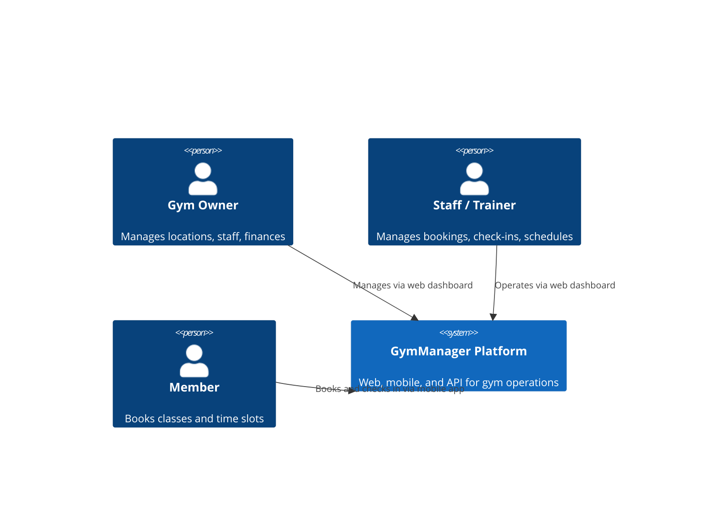
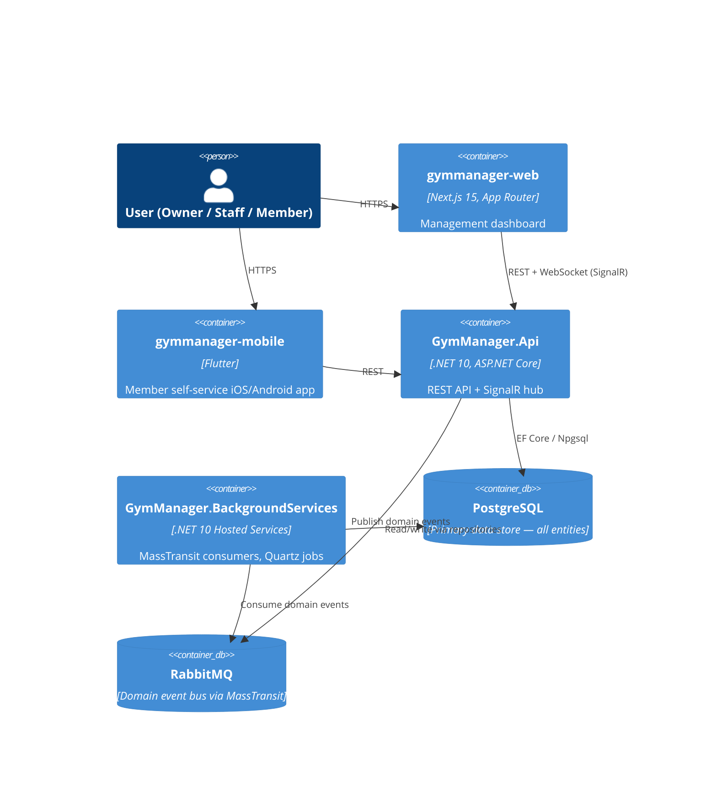
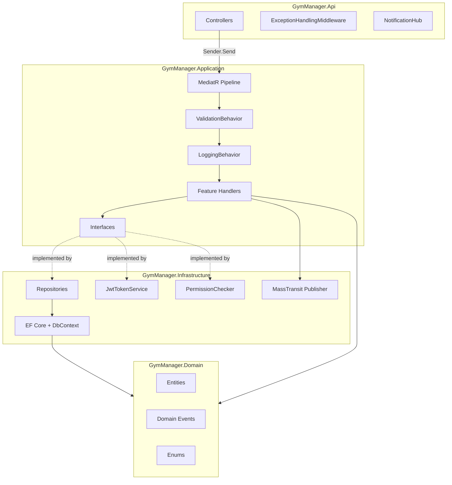
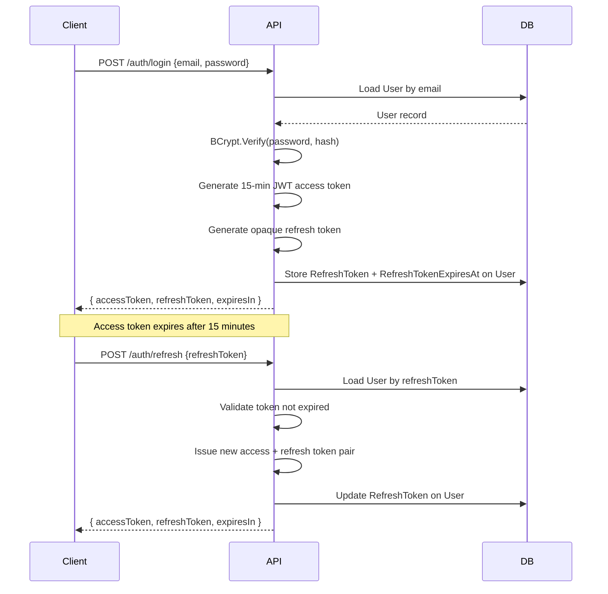
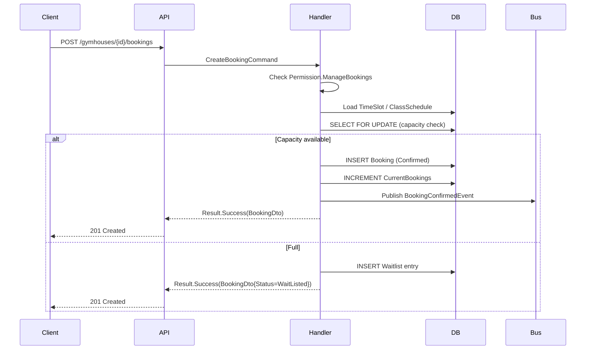
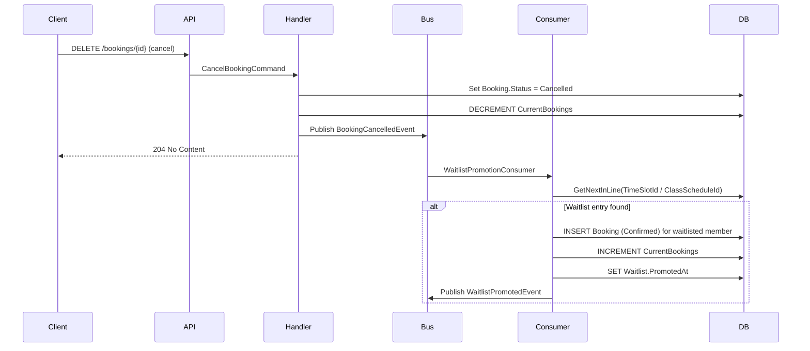
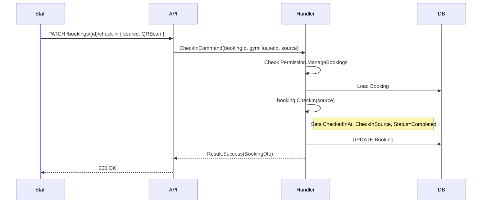

# Architecture

## System Context

GymManager serves gym owners who manage 2–5 physical locations. Each location is a `GymHouse`. Gym staff, trainers, and members access the platform through a web dashboard or mobile app. All clients call a single API.



---

## Container Diagram



---

## Component Diagram — API and Core



---

## Multi-Tenancy

**Strategy:** Shared database, `GymHouseId` discriminator column on every tenant-scoped entity.

```
Owner (User)
 └── GymHouse [1]
     ├── Members
     ├── Subscriptions
     ├── TimeSlots
     ├── ClassSchedules
     ├── Bookings
     └── Waitlist entries
 └── GymHouse [2]
     └── (separate data — same DB)
```

**Enforcement mechanism:**

1. JWT contains `tenant_id` claim (the active `GymHouseId`).
2. `ICurrentUser.TenantId` extracts it from `HttpContext`.
3. EF Core global query filter on every scoped entity: `WHERE gym_house_id = @tenantId AND deleted_at IS NULL`.
4. Permission checker evaluates permissions within the tenant boundary.

**Cross-tenant access:** Owners can query any `GymHouse` they own. `IPermissionChecker.HasPermissionAsync()` validates this before any query executes.

**Risk:** Incorrect `IgnoreQueryFilters()` call leaks cross-tenant data. Mitigation: integration tests with two tenants, code review checklist item.

---

## Authentication Flow



**JWT claims:**

| Claim | Value |
|---|---|
| `sub` (NameIdentifier) | `user.Id` (UUID) |
| `email` | user email |
| `role` | `Role` enum name |
| `permissions` | `(long)user.Permissions` |
| `tenant_id` | active `GymHouseId` |

Access token TTL: **15 minutes**. Algorithm: HMAC-SHA256.

---

## Booking Creation Flow



---

## Waitlist Promotion Flow



---

## Check-In Flow



---

## Soft Delete

No hard deletes in application code. All entities have `deleted_at TIMESTAMPTZ NULL`. EF Core global query filter: `WHERE deleted_at IS NULL`. Soft delete sets `DeletedAt = DateTime.UtcNow`.

---

## Permission System

`IPermissionChecker` is the single enforcement point for all permission decisions. Controllers never check permissions directly.

```
Handler
  └── IPermissionChecker.HasPermissionAsync(userId, tenantId, permission, ct)
        └── PermissionChecker (Infrastructure)
              ├── Loads RolePermission for (tenantId, user.Role)
              └── Returns (user.Permissions & required) != 0
```

**RBAC per tenant:** `RolePermission` stores a permission bitmask per `(TenantId, Role)`. Owners can customize which permissions each role holds within their GymHouse. Changes take effect immediately (no token refresh required for server-side enforcement).

**Default permissions** are seeded from `RoleSeedData` when a tenant is created. Owners can reset to defaults via `POST /roles/reset-defaults`.

---

## Error Handling

All handler errors flow through `ApiControllerBase.HandleResult()`. The method inspects the error string prefix to determine the HTTP status:

| Prefix | Status | ProblemDetails title |
|--------|--------|---------------------|
| `[NOT_FOUND]` | 404 | `Not Found` |
| `[FORBIDDEN]` | 403 | `Forbidden` |
| `[CONFLICT]` | 409 | `Conflict` |
| (none / other) | 400 | `Bad Request` |
| Thrown `ValidationException` | 422 | `Validation failed` |
| Unhandled exception | 500 | `Internal Server Error` |

All ProblemDetails responses include `status`, `title`, `detail`, and `instance` (request path).

---

## Security Headers

An inline middleware runs after `UseHttpsRedirection()` and sets:

```
X-Content-Type-Options: nosniff
X-Frame-Options: DENY
Referrer-Policy: strict-origin-when-cross-origin
Permissions-Policy: camera=(), microphone=(), geolocation=()
```

HSTS is enabled in non-development environments.

---

## JWT Startup Validation

`Program.cs` reads `Jwt:Secret` and fails fast at startup if:
- The value is absent or empty (`ArgumentException.ThrowIfNullOrWhiteSpace`)
- The value is shorter than 32 characters (`InvalidOperationException`)

This prevents silent misconfiguration in new deployments.

---

## Key Architectural Decisions

See [`docs/adrs/260317-gymmanager-platform-architecture.md`](adrs/260317-gymmanager-platform-architecture.md) for full rationale.

| Decision | Choice | Rationale |
|---|---|---|
| Multi-tenancy | Shared DB + `GymHouseId` | Simple for 2–5 locations; PostgreSQL RLS in Phase 6 |
| Financial ledger | Append-only Transaction table | P&L queries trivial; no double-entry overhead |
| Booking engine | Unified `Booking` entity + `BookingType` | Simple member API; branching confined to Create/Cancel |
| Aggregate roots | 6: GymHouse, Member, Booking, ClassSchedule, Staff, Transaction | Aligned with business operations |
| Notifications | SignalR (web) + FCM (mobile) | MassTransit fan-out; `NotificationDelivery` tracks per-recipient |
| Error handling | `Result<T>` over exceptions | Explicit failure paths; no exception-as-flow-control |

---

## Future Phases

| Phase | Key Components |
|---|---|
| Phase 3 — Finance | `Transaction` entity, P&L reports, revenue dashboards |
| Phase 4 — Staff/HR | `Staff`, `ShiftAssignment`, `PayrollPeriod`, `PayrollEntry` |
| Phase 5 — Communications | `Announcement`, `NotificationDelivery`, SignalR fan-out, FCM push |
| Phase 6 — Hardening | PostgreSQL RLS, load testing, offline mobile queue, payment gateway |
