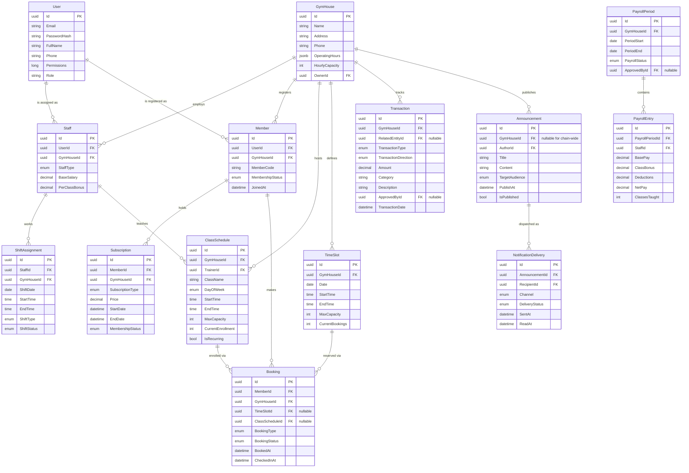
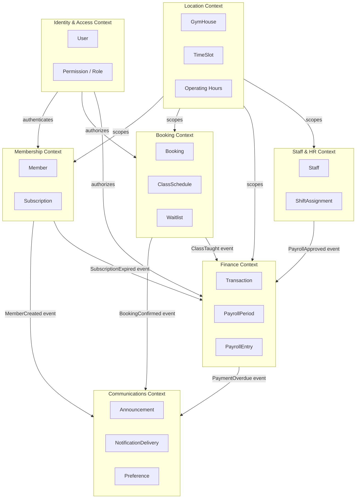
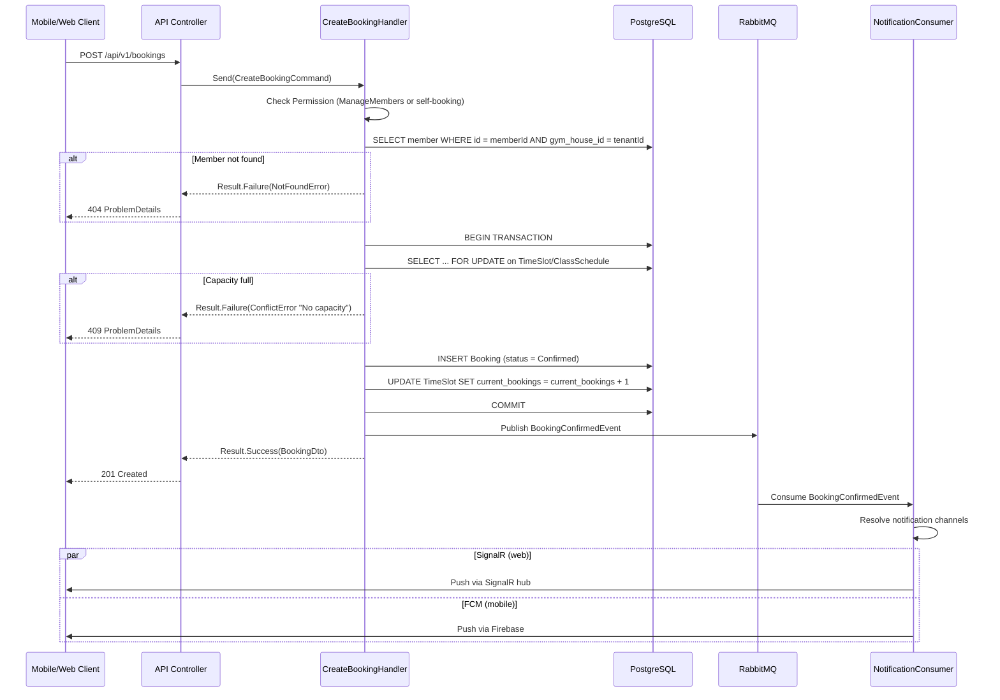
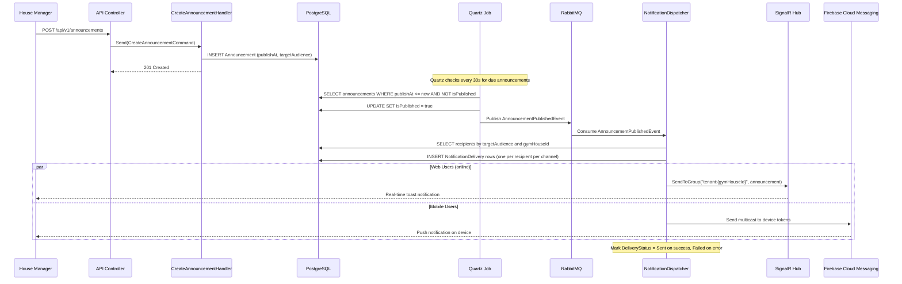

# Brainstorm Results -- GymManager Platform

**Date:** 2026-03-17
**Analyst:** Solution Analyzer (Phases 5-8)
**Input:** brainstorm-state.md (5 confirmed clusters, 24 ideas)

---

## Research Brief (Phase 5 Synthesis)

**Stream A -- Prior Art:** Existing open-source gym platforms (Gympify, WGER, GYM One, MotionGym) all treat single-location as the default. Only Gympify addresses multi-tenancy, using database-per-tenant isolation. None implement a double-entry financial ledger or a CQRS booking engine. The market is consolidating around AI-powered scheduling and predictive analytics, but those features are out of scope for v1. The core lesson: most gym platforms bolt on multi-location late and suffer data model debt. Designing multi-location from day one is a structural advantage.

**Stream B -- Technology Evaluation:** EF Core global query filters with a `GymHouseId` discriminator column are the established pattern for shared-database multi-tenancy at small scale (2-20 tenants). PostgreSQL Row-Level Security (RLS) adds 1-5% overhead but provides defense-in-depth against application bugs leaking cross-tenant data. For notifications, the hybrid approach -- SignalR for real-time web, Firebase Cloud Messaging for mobile push -- is the proven .NET pattern with negligible coupling between the two. MassTransit 8.5 handles the fan-out via consumers that dispatch to each channel.

**Stream C -- Architecture Patterns:** For the booking engine, pessimistic locking (`SELECT ... FOR UPDATE`) on the TimeSlot row prevents double-booking with zero application complexity. Optimistic concurrency (version column) is better when conflicts are rare. Given gym time-slot capacity is typically 20-50 per slot, pessimistic locking on the capacity counter row is the right choice -- conflicts will be frequent during peak hours. For the financial ledger, the append-only transaction journal with a zero-sum invariant (every Transaction row has entries that sum to zero) is the standard double-entry pattern. No UPDATE or DELETE on journal entries; corrections are new reversing entries.

**Stream D -- Failure Cases:** The primary failure modes for booking systems are: (1) race conditions from check-then-act without row locks, (2) ghost bookings from payment timeouts without TTL-based reservation expiry, (3) cross-location booking confusion when a member books at House A but checks in at House B. For financial systems: (1) mutable ledger entries destroy audit trails, (2) floating-point currency arithmetic causes rounding drift, (3) salary calculation without a clear pay-period snapshot creates disputes. For multi-tenancy: forgetting the tenant filter on a single query leaks all tenant data -- RLS is the safety net.

---

## Phase 6: Decision Matrix

### Criteria Weights (assumed equal -- no weights provided in brainstorm-state.md)

| Weight | Criterion |
|--------|-----------|
| 20% | Complexity (lower is better) |
| 20% | Scalability (higher is better) |
| 20% | Query Performance |
| 20% | Migration Path (ease of evolving) |
| 20% | Developer Experience |

---

### Decision 1: Multi-Tenancy Approach

| Option | Complexity | Scalability | Query Perf | Migration Path | Dev Experience | Weighted Score |
|--------|-----------|-------------|------------|---------------|----------------|----------------|
| **A. Shared DB + GymHouseId discriminator (EF global filter)** | 9 | 6 | 8 | 8 | 9 | **8.0** |
| **B. Shared DB + GymHouseId + PostgreSQL RLS** | 7 | 7 | 7 | 7 | 7 | **7.0** |
| **C. Schema-per-tenant** | 4 | 8 | 9 | 4 | 4 | **5.8** |

**Justification:**

- **Option A (Recommended):** A single `GymHouseId` column on every tenant-scoped entity, enforced by EF Core global query filter (`builder.HasQueryFilter(e => e.GymHouseId == _tenantId)`). Simplest to implement, query, and migrate. At 2-5 locations this is the correct choice. The ICurrentUser already carries TenantId.
- **Option B:** Adds PostgreSQL RLS policies as a second enforcement layer. Worth adding as a Phase 2 hardening step, but not required for launch. Adds migration complexity (every new table needs a policy).
- **Option C:** Separate schemas per gym house. Overkill for 2-5 locations, complicates cross-location queries (chain-wide members, aggregated P&L), and makes EF migrations painful.

**Recommendation:** Option A for launch. Add RLS (Option B) as a hardening pass before onboarding external gym chains.

---

### Decision 2: Financial Ledger Design

| Option | Complexity | Scalability | Query Perf | Migration Path | Dev Experience | Weighted Score |
|--------|-----------|-------------|------------|---------------|----------------|----------------|
| **A. Single Transaction table with TransactionType enum** | 8 | 7 | 8 | 8 | 8 | **7.8** |
| **B. Double-entry journal (Transaction + TransactionEntry)** | 5 | 9 | 6 | 6 | 5 | **6.2** |
| **C. Separate Income/Expense tables** | 7 | 5 | 7 | 5 | 7 | **6.2** |

**Justification:**

- **Option A (Recommended):** A single `Transaction` table with `TransactionType` (Income, Expense, SalaryPayment, MembershipFee, Refund), `Amount` (decimal, always positive), `Direction` (Credit/Debit), and `Category`. Simple, auditable (append-only with soft delete), and sufficient for a gym's financial complexity. P&L queries are straightforward GROUP BY on type and category.
- **Option B:** True double-entry with a journal header and line items. Correct for accounting software, but a gym management platform does not need multi-account balancing. The added complexity (account chart, zero-sum constraint, reversal entries) delays delivery without business benefit at this scale.
- **Option C:** Separate tables for income and expenses force JOIN-heavy P&L queries and create ambiguity about where refunds and transfers live.

**Recommendation:** Option A. Store all financial events in one append-only Transaction table. Add a `BalanceSnapshot` materialized view for dashboard queries. If the platform later serves accounting firms, migrate to Option B.

---

### Decision 3: Booking Engine Design

| Option | Complexity | Scalability | Query Perf | Migration Path | Dev Experience | Weighted Score |
|--------|-----------|-------------|------------|---------------|----------------|----------------|
| **A. Unified Booking entity (covers time-slots and classes)** | 7 | 7 | 7 | 8 | 8 | **7.4** |
| **B. Separate TimeSlotReservation + ClassEnrollment entities** | 5 | 8 | 8 | 6 | 6 | **6.6** |
| **C. Event-sourced booking aggregate** | 3 | 9 | 5 | 4 | 3 | **4.8** |

**Justification:**

- **Option A (Recommended):** A single `Booking` entity with `BookingType` (TimeSlot, ClassSession). Both types share: Member, GymHouse, StartTime, EndTime, Status (Confirmed, Cancelled, NoShow, Completed). ClassSession bookings additionally reference a `ClassSchedule` and `Trainer`. This keeps queries simple (one table for "show me all bookings for member X") and avoids the overhead of syncing two parallel booking systems.
- **Option B:** Cleaner aggregate boundaries but duplicates booking logic (cancellation, waitlist, no-show tracking) across two entities.
- **Option C:** Event sourcing adds infrastructure weight (event store, projections, snapshotting) that is unjustified for a gym with 50-200 bookings/day.

**Recommendation:** Option A. Use `BookingType` discriminator. Concurrency control via `SELECT ... FOR UPDATE` on the capacity counter row in `TimeSlot` or `ClassSchedule`.

---

## Phase 7: Visual Architecture

### Diagram 1: Domain Entity Relationship Diagram



### Diagram 2: Bounded Context Map



### Diagram 3: Booking Flow Sequence Diagram



### Diagram 4: Notification Delivery Sequence Diagram



---

## Phase 8: Adversarial Debate

### 1. Devil's Advocate -- Arguments Against the Recommended Approach

**Against shared-DB with discriminator column:**
The EF global query filter is application-level enforcement only. A single developer writing a raw SQL query, a Dapper call, or an EF query with `IgnoreQueryFilters()` will leak cross-tenant data. This is not hypothetical -- it is the single most common multi-tenancy bug in .NET applications. The mitigation (adding RLS later) should arguably be a launch requirement, not a Phase 2 item.

**Against single Transaction table:**
A single table mixing membership fees, salary payments, rent, and ad-hoc expenses will grow into a "god table" with nullable columns for each transaction type's specific fields (e.g., `StaffId` only relevant for salary payments, `MemberId` only for fees). This pushes complexity into the query layer with conditional WHERE clauses.

**Against unified Booking entity:**
TimeSlot bookings and ClassSession enrollments have different lifecycles. A class can be cancelled by the trainer (affecting all enrollees), while a time-slot booking is cancelled individually. The unified entity will accumulate `BookingType`-specific branching in every handler that touches bookings.

**Counterarguments (accepted):**
- Discriminator + RLS later is a deliberate trade-off for speed-to-market. The existing `ICurrentUser.TenantId` and `IPermissionChecker` pattern already centralizes tenant scoping.
- The Transaction table's nullable FKs (`RelatedEntityId`) are acceptable at gym scale (thousands of transactions/month, not millions). The alternative (polymorphic tables) is worse.
- Unified Booking keeps the member-facing API simple. The `BookingType` branching is confined to two command handlers (CreateBooking, CancelBooking) and one domain event handler. Manageable.

### 2. Assumption Stress-Test

| Assumption | What if wrong? | Mitigation |
|---|---|---|
| 2-5 locations for the foreseeable future | At 20+ locations, shared DB hits connection pool limits and query filter overhead compounds | Add read replicas. If beyond 50, migrate to schema-per-tenant. |
| Manual payment first, gateway later | Members expect online payment from day one; manual entry causes data entry errors | Design the Transaction table with a `PaymentMethod` enum and `ExternalReference` field from the start. Gateway integration becomes a new PaymentMethod value. |
| Trainers work at one primary location | Trainers float across 3+ houses; salary calculation per-house becomes complex | Staff entity already has GymHouseId. For multi-house trainers, create one Staff record per house (same UserId, different GymHouseId). PayrollEntry aggregates by StaffId per house. |
| Booking conflicts are rare (low member density) | Popular time slots see 50+ simultaneous booking attempts | `SELECT ... FOR UPDATE` on the capacity counter row serializes conflicting transactions. PostgreSQL handles this at thousands of TPS. |
| SignalR connections stay under 1000 concurrent | Viral growth pushes to 10K+ connections | Move to Azure SignalR Service (managed backplane). No code changes required -- just a connection string swap. |

### 3. Pre-Mortem -- "6 Months From Now This Failed"

**Scenario 1: Cross-Location Data Leak.**
A developer wrote a reporting query using `IgnoreQueryFilters()` to aggregate data across houses for the owner dashboard. They forgot to re-add the house filter for manager-level users. A house manager at Location B sees Location A's financial data. Trust is broken.
*Prevention:* Establish a code review checklist item: every `IgnoreQueryFilters()` call requires an explicit comment explaining why and a corresponding test proving tenant isolation holds.

**Scenario 2: Booking No-Show Disputes.**
Members claim they checked in but the system shows NoShow. The check-in mechanism (QR scan? manual toggle?) was never properly specified. Disputes consume manager time and erode member trust.
*Prevention:* Define the check-in mechanism in Phase 1. Add a `CheckInSource` enum (QRScan, ManualByStaff, SelfKiosk) to the Booking entity and log the timestamp + source.

**Scenario 3: Salary Calculation Errors.**
A trainer teaches a class at House A on Monday and House B on Tuesday. The payroll system counts only House A classes because the query filters by the manager's TenantId. The trainer is underpaid.
*Prevention:* Payroll calculation must run with Owner-level permissions (all houses) or use a dedicated payroll service account that queries across houses. The PayrollEntry table stores per-house breakdowns; the PayrollPeriod aggregates them.

**Scenario 4: Notification Spam.**
A chain-wide announcement sends push notifications to all members at all houses simultaneously. Members at houses where the announcement is irrelevant unsubscribe from push notifications entirely.
*Prevention:* Default announcement scope to single-house. Chain-wide announcements require Owner permission and a confirmation step. Implement notification preferences per user from day one.

**Scenario 5: Financial Audit Failure.**
The Transaction table allows soft-delete. An operator soft-deletes a transaction to "correct" it. The audit trail is broken because the global query filter hides deleted records from reports.
*Prevention:* Financial queries must use `IgnoreQueryFilters()` for the `DeletedAt` filter, or better: disable soft-delete on the Transaction table entirely. Corrections are new reversing transactions with a `ReversesTransactionId` FK.

### 4. Constraint Inversion

**10x budget (well-funded startup):**
- Use Azure SignalR Service from day one instead of self-hosted.
- Add Redis for distributed caching and session management.
- Implement full double-entry ledger (Option B) with a proper chart of accounts.
- Schema-per-tenant for stronger isolation.
- Dedicated QA team running load tests with k6 against booking endpoints.
- Hire a DBA to set up PostgreSQL RLS policies from the start.

**1/10th budget (solo developer):**
- Drop the notification system entirely; use email via SendGrid.
- Drop shift scheduling; manage it in a spreadsheet.
- Merge Staff and Member into a single User entity with role flags.
- Skip RabbitMQ; use MediatR in-process notifications only.
- Deploy as a single monolith (API + background jobs in one process).
- The core value proposition (member management + booking + basic finance) still works.

---

## Recommended Approach

### Architecture Summary

1. **Multi-tenancy:** Shared PostgreSQL database with `GymHouseId` discriminator column on all tenant-scoped entities. EF Core global query filter enforces tenant isolation. `ICurrentUser.TenantId` flows from JWT claims through every request. Add PostgreSQL RLS as a hardening pass in Phase 2.

2. **Domain model:** Six aggregate roots -- `GymHouse`, `Member` (with `Subscription` child), `Booking`, `ClassSchedule`, `Staff` (with `ShiftAssignment` child), `Transaction`. All inherit from `AuditableEntity`. All concrete classes sealed.

3. **Booking engine:** Unified `Booking` entity with `BookingType` discriminator. Concurrency control via `SELECT ... FOR UPDATE` on the `TimeSlot.CurrentBookings` or `ClassSchedule.CurrentEnrollment` counter. Waitlist as a separate entity with auto-promotion via a MassTransit consumer on `BookingCancelledEvent`.

4. **Financial ledger:** Single append-only `Transaction` table. Corrections via reversing entries (`ReversesTransactionId`). Soft-delete disabled on this table. PayrollPeriod/PayrollEntry for salary management with approval workflow.

5. **Notifications:** Announcement entity with scheduled publishing (Quartz job). MassTransit event fan-out to SignalR (web) and FCM (mobile) via separate consumers. NotificationDelivery table tracks per-recipient delivery status.

6. **Staff/HR:** Staff entity linked to User (one Staff record per GymHouse assignment). ShiftAssignment for guards/cleaners. PayrollPeriod with approval workflow generates Transaction entries on approval.

### Permission Enum Expansion

Extend the existing `[Flags] Permission : long` enum with new bits:

```
// Existing: bits 0-11
// New additions:
ManageBookings     = 1L << 12,
ViewBookings       = 1L << 13,
ManageSchedule     = 1L << 14,
ViewSchedule       = 1L << 15,
ManageFinance      = 1L << 16,
ViewFinance        = 1L << 17,
ManageStaff        = 1L << 18,
ViewStaff          = 1L << 19,
ManageAnnouncements = 1L << 20,
ViewAnnouncements  = 1L << 21,
ApprovePayroll     = 1L << 22,
ManageShifts       = 1L << 23,
ViewShifts         = 1L << 24,
ManageWaitlist     = 1L << 25,
```

### Key API Endpoints (v1)

| Method | Route | Permission | Handler |
|--------|-------|------------|---------|
| POST | /api/v1/gym-houses | ManageTenant | CreateGymHouseCommand |
| GET | /api/v1/gym-houses | ViewMembers | GetGymHousesQuery |
| POST | /api/v1/members | ManageMembers | CreateMemberCommand |
| GET | /api/v1/members | ViewMembers | GetMembersQuery |
| POST | /api/v1/members/{id}/subscriptions | ManageSubscriptions | CreateSubscriptionCommand |
| POST | /api/v1/bookings | ManageBookings | CreateBookingCommand |
| DELETE | /api/v1/bookings/{id} | ManageBookings | CancelBookingCommand |
| GET | /api/v1/bookings | ViewBookings | GetBookingsQuery |
| POST | /api/v1/class-schedules | ManageSchedule | CreateClassScheduleCommand |
| GET | /api/v1/class-schedules | ViewSchedule | GetClassSchedulesQuery |
| POST | /api/v1/transactions | ManageFinance | RecordTransactionCommand |
| GET | /api/v1/transactions | ViewFinance | GetTransactionsQuery |
| GET | /api/v1/reports/pnl | ViewReports | GetPnLReportQuery |
| POST | /api/v1/staff | ManageStaff | CreateStaffCommand |
| POST | /api/v1/shift-assignments | ManageShifts | CreateShiftAssignmentCommand |
| POST | /api/v1/payroll-periods | ApprovePayroll | CreatePayrollPeriodCommand |
| PATCH | /api/v1/payroll-periods/{id}/approve | ApprovePayroll | ApprovePayrollCommand |
| POST | /api/v1/announcements | ManageAnnouncements | CreateAnnouncementCommand |
| GET | /api/v1/announcements | ViewAnnouncements | GetAnnouncementsQuery |
| GET | /api/v1/time-slots | ViewBookings | GetTimeSlotsQuery |

### Accepted Trade-offs

| Trade-off | Accepted risk | Mitigation |
|---|---|---|
| No RLS at launch | Application bug could leak tenant data | Code review checklist + integration tests per tenant |
| Single Transaction table | Nullable FKs for type-specific references | Clear TransactionType enum prevents ambiguity |
| Unified Booking entity | BookingType branching in handlers | Confined to 2-3 handlers; simpler than parallel systems |
| Manual payment only at launch | Data entry errors, member friction | PaymentMethod enum + ExternalReference field designed in from day one |
| No offline booking in Flutter v1 | Mobile users without connectivity cannot book | REST fallback; offline queue deferred to Phase 2 |

---

## Risk Register

| ID | Risk | Likelihood | Impact | Mitigation |
|----|------|-----------|--------|------------|
| R1 | Cross-tenant data leak via IgnoreQueryFilters | Medium | Critical | Integration tests asserting tenant isolation; add RLS in Phase 2 |
| R2 | Double-booking under concurrent load | Low | High | `SELECT ... FOR UPDATE` on capacity counter; load test with k6 |
| R3 | Salary miscalculation for multi-house trainers | Medium | High | PayrollEntry stores per-house breakdown; owner-level query for aggregation |
| R4 | Mutable financial records break audit trail | Low | Critical | Disable soft-delete on Transaction; corrections via reversing entries only |
| R5 | Notification spam from chain-wide announcements | Medium | Medium | Default to single-house scope; Owner-only for chain-wide; user preferences |
| R6 | SignalR connection saturation | Low | Medium | Monitor connection count; swap to Azure SignalR Service if needed |
| R7 | Member books at House A, checks in at House B | Medium | Medium | Allow cross-house check-in for chain-wide memberships; log discrepancy |
| R8 | Payroll approval workflow bypassed | Low | High | ApprovePayroll permission on a dedicated bit; audit log on status transitions |
| R9 | Floating-point rounding in financial calculations | Low | Medium | Use `decimal(18,2)` in C# and `NUMERIC(18,2)` in PostgreSQL; never `float` |
| R10 | Message contract break after RabbitMQ publish | Low | High | Follow existing immutability rule from CLAUDE.md; versioned contracts |

---

## Phased Implementation Order

**Phase 1 (Foundation):** GymHouse + User + Member + Subscription + Permission expansion
**Phase 2 (Booking):** TimeSlot + ClassSchedule + Booking + Waitlist + check-in
**Phase 3 (Finance):** Transaction + P&L reports + revenue dashboards
**Phase 4 (Staff/HR):** Staff + ShiftAssignment + PayrollPeriod + PayrollEntry
**Phase 5 (Communications):** Announcement + NotificationDelivery + SignalR + FCM integration
**Phase 6 (Hardening):** PostgreSQL RLS + load testing + offline mobile queue + online payment gateway
