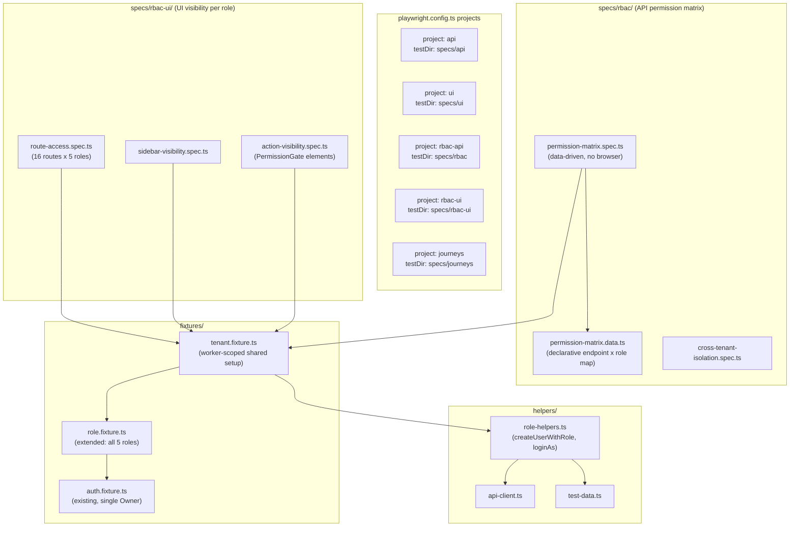
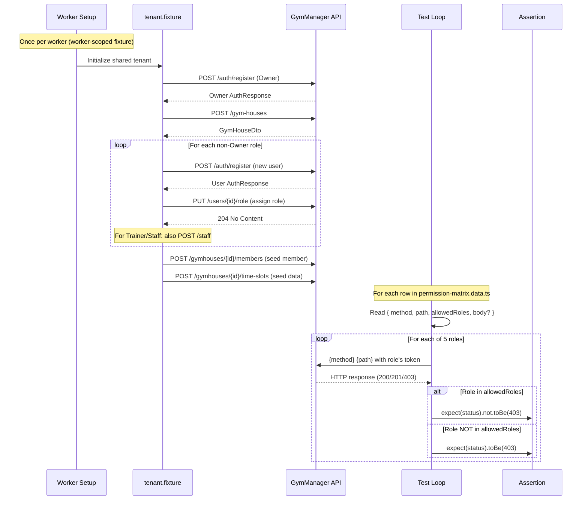
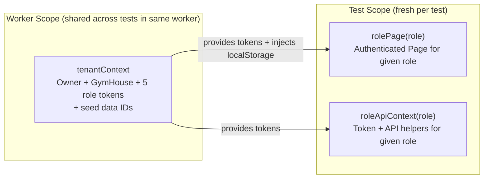
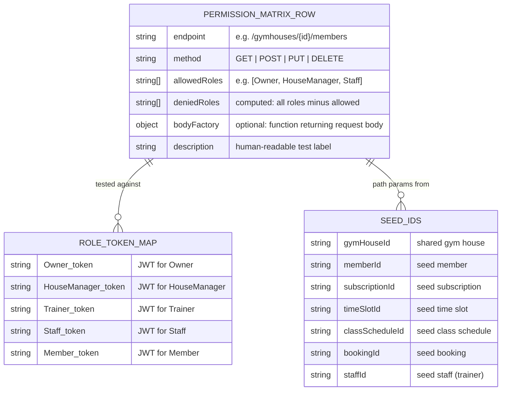

# Brainstorm Results: RBAC E2E Test Coverage

## Research Brief

**Stream A -- Prior Art**: Multi-role E2E testing in SaaS platforms typically follows a "shared tenant, multiple actors" pattern. Projects like Backstage, Supabase, and multi-tenant CRMs use a single test-setup phase where an admin provisions all role users, then run parameterized test cases per role. The dominant pattern in Playwright communities is data-driven test generation using `for...of` loops over role arrays inside `test.describe`, not monolithic matrix files. Cypress intercept-based approaches (stub JWT claims) are fast but skip real permission enforcement; Playwright's direct API + browser approach catches more real bugs.

**Stream B -- Technology Evaluation**: Playwright natively supports parameterized tests via `for...of` loops in `test.describe` blocks (no plugin required). `test.step()` provides sub-test labeling for matrix rows. Playwright projects (in `playwright.config.ts`) can model roles but add config complexity. The existing codebase already uses `apiRequestRaw()` which returns raw `Response` objects -- ideal for asserting 403 status without throwing. Worker-scoped fixtures (`{ scope: 'worker' }`) can share expensive setup across tests in the same worker.

**Stream C -- Architecture Patterns**: The "Fixture Hierarchy" pattern works well here: a worker-scoped `tenantContext` fixture creates Owner + GymHouse + all role users once per worker. Test-scoped fixtures then select a specific role's token. The "Negative Test Matrix" pattern uses a declarative JSON/TS object mapping `{ endpoint, method, allowedRoles }` and generates one test per role per endpoint. The "Boundary Probe" pattern tests only the permission boundary (roles that should be denied) rather than all 5 roles on every endpoint, reducing test count by ~60%.

**Stream D -- Failure Cases**: Common pitfalls: (1) Shared mutable state between role tests causes ordering-dependent flakiness. (2) Creating users per test (not per worker) makes suites 5-10x slower. (3) Token-forge approaches that skip real auth miss middleware bugs. (4) Testing only "happy path allowed" without "denied roles get 403" creates false confidence. (5) Forgetting to test the Member role (read-only) leads to over-permissive APIs shipping undetected. (6) UI visibility tests that check DOM presence without checking server enforcement miss "hidden button but accessible via URL" bugs.

---

## Decision Matrix

Weights assumed equal (no weights provided in brainstorm-state.md).

| Criterion | A: Monolithic Matrix | B: Domain-Sliced | C: Role-Sliced | D: Hybrid (API matrix + UI per-role) |
|---|---|---|---|---|
| **Maintainability** | 2/5 -- Single 1000+ line files become unmaintainable. Adding a permission requires editing one huge file. | 4/5 -- Adding a new entity means one new file. Clear ownership per domain. | 3/5 -- Adding a new permission requires touching all 5 role files. Cross-cutting. | 4/5 -- API matrix is one file with declarative data; UI files are small and domain-focused. |
| **Execution Speed** | 3/5 -- Playwright runs tests within a file serially by default. One huge file = one serial queue. | 4/5 -- Multiple domain files can run in parallel across workers. | 3/5 -- 5 role files can parallelize, but each file is large. | 5/5 -- API tests are pure HTTP (no browser), run fast. UI tests are fewer and targeted. |
| **Coverage Completeness** | 4/5 -- Forces you to fill every cell in the matrix. Hard to miss a case. | 3/5 -- Easy to forget a role when adding a domain feature. No global view of what is tested. | 3/5 -- Easy to forget a domain when adding a role. Coverage gaps at domain boundaries. | 5/5 -- The declarative matrix guarantees every endpoint x role is covered. UI tests cover visibility gaps. |
| **Developer Experience** | 2/5 -- Scrolling through 1000+ lines. Merge conflicts when two devs add tests. | 4/5 -- Devs work in their domain file. Familiar structure mirroring the app. | 2/5 -- Devs must understand all domains to modify a role file. | 4/5 -- The matrix DSL is easy to extend: add one row per new endpoint. UI specs are standard Playwright. |
| **Debugging Ease** | 2/5 -- Failures in a monolith are hard to isolate. Test names are deeply nested. | 4/5 -- Failure clearly points to a domain + role. | 3/5 -- Failure points to a role but domain context is scattered. | 4/5 -- API failures show `[POST /members] Trainer => 403`. UI failures show specific visibility assertion. |
| **TOTAL** | **13/25** | **19/25** | **14/25** | **22/25** |

**Approach D (Hybrid)** scores highest. It separates concerns: API tests verify permission enforcement exhaustively via a data-driven matrix; UI tests verify visibility and navigation per role using smaller, focused spec files.

---

## Architecture Diagrams

### Diagram 1: Test File Structure and Fixture Hierarchy

### Diagram 2: Data Flow -- Permission Matrix Test Execution

### Diagram 3: Fixture Hierarchy -- Scope and Lifetime

### Diagram 4: Permission Matrix Data Structure

---

## Adversarial Debate

### 1. Devil's Advocate -- Against Approach D (Hybrid)

**The split creates cognitive overhead.** Developers must now understand two test paradigms: a declarative API matrix and standard Playwright UI specs. When a new endpoint is added, the developer must remember to add a row to the matrix file AND potentially update UI visibility specs. There is no compile-time or lint-time check that forces this.

**The API matrix may over-test.** If 26 permissions map to ~40 endpoints, testing 5 roles x 40 endpoints = 200 API calls per run. Each requires a real HTTP round-trip. With workers=1 (current config), this adds 30-60 seconds to the suite. With parallel workers, it is faster, but test isolation becomes harder.

**The boundary-only optimization is fragile.** Testing only denied roles (not confirming allowed roles succeed) means a regression that breaks legitimate access goes undetected.

**Counter-argument:** The matrix should test both allowed AND denied. The 200-test count is acceptable for API-only tests (no browser overhead). Cognitive overhead is mitigated by a clear convention: "new endpoint = new matrix row."

### 2. Assumption Stress-Test

| Assumption | What if wrong? | Mitigation |
|---|---|---|
| All roles can be assigned via `PUT /users/{id}/role` | If role assignment requires additional steps (e.g., staff record creation for Trainer), fixtures break | Fixture must handle role-specific setup (already identified: Trainer/Staff need a staff record) |
| Registered users default to Owner role | If default is Member, the Owner fixture setup breaks | Verify registration flow; first user in a tenant is always Owner by convention |
| 403 is the only denial status code | Some endpoints may return 401 (unauthenticated) or 404 (resource hidden) instead of 403 | Matrix should support expectedDeniedStatus per row, defaulting to 403 |
| Permissions are checked in command handlers | If some controllers check permissions directly, the bitmask model breaks | Audit controllers for any direct permission checks (CLAUDE.md says never -- verify) |
| Worker-scoped fixtures are stable across retries | Playwright retries create new test instances but reuse worker fixtures | Worker fixtures must be idempotent; seed data must not be mutated by tests |
| Single-worker execution (workers=1) persists | If parallelized later, shared DB state causes conflicts | Each worker creates its own tenant (worker-scoped fixture already handles this) |

### 3. Pre-Mortem: "Six months from now, this failed. What went wrong?"

**Scenario 1: Matrix Drift.** New endpoints were added but nobody updated `permission-matrix.data.ts`. Coverage silently dropped. A Member could access a finance endpoint undetected.
*Prevention:* Add a CI check that compares endpoint count in the matrix against a count of `[HttpGet/Post/Put/Delete]` attributes in the API controllers. Flag drift.

**Scenario 2: Fixture Setup Timeout.** The worker-scoped fixture that creates 5 users + seed data started timing out as more seed data was added. Tests became flaky in CI.
*Prevention:* Keep seed data minimal. Each matrix row should specify only the data it needs. Use lazy creation patterns.

**Scenario 3: Role Change API Broke Silently.** The `PUT /users/{id}/role` endpoint changed its contract (e.g., required a `gymHouseId` body param). All non-Owner fixtures failed, but the error message was unclear.
*Prevention:* Fixture setup should have explicit error messages: "Failed to assign role HouseManager to user {id}: {detail}".

**Scenario 4: Permission Bitmask Mismatch.** The backend changed default permissions for Trainer (added ManageBookings), but the matrix still expected 403 for Trainer on booking mutations. Tests failed, and the developer "fixed" them by removing the assertion instead of understanding the change.
*Prevention:* Matrix data should reference permission names, not hardcoded expectations. Generate expected allowed/denied from the same source of truth (RolePermissionDefaults).

**Scenario 5: UI Tests Became Brittle.** Sidebar labels changed ("Finance" to "Financial Dashboard"), breaking visibility tests across all 5 role specs.
*Prevention:* Use `data-testid` attributes on sidebar items and PermissionGate wrappers. Never match on visible text for structural tests.

### 4. Constraint Inversion

**10x budget (unlimited time, large team):**
- Add contract tests: auto-generate the permission matrix from backend metadata (`GET /roles/metadata` already exists).
- Add visual regression tests per role (screenshots of each page).
- Add performance tests: measure API response time per role to detect N+1 queries in permission checks.
- Build a custom Playwright reporter that renders a "permission heatmap" in CI.

**1/10th budget (minimal effort):**
- Drop UI visibility tests entirely. Focus only on the API permission matrix.
- Use a single test file with a hardcoded JSON array of ~20 critical endpoints (not all 40+).
- Skip cross-tenant isolation tests.
- Use the existing `role.fixture.ts` (Owner + Trainer + Member only) instead of building full 5-role support.

This 1/10th version still catches the most dangerous bugs (unauthorized write access) while skipping cosmetic coverage (sidebar visibility).

---

## Recommended Approach

**Approach D: Hybrid (API Permission Matrix + UI Role Visibility)**

### Architecture

1. **`fixtures/tenant.fixture.ts`** (worker-scoped): Creates one Owner, one GymHouse, registers 4 additional users, assigns them roles (HouseManager, Trainer, Staff, Member) via `PUT /users/{id}/role`, creates seed data (member, subscription, time slot, class schedule, booking, transaction, staff record). Exports a `TenantContext` object with all tokens and entity IDs.

2. **`helpers/role-helpers.ts`**: Provides `createUserWithRole(ownerToken, gymHouseId, role)` that handles the full chain: register user, assign role, create staff record if needed, login to get role-specific token.

3. **`specs/rbac/permission-matrix.data.ts`**: Declarative array of `{ method, path, allowedRoles, bodyFactory?, description }`. One entry per permission-gated endpoint. Derived from `RolePermissionDefaults.cs` and controller audit.

4. **`specs/rbac/permission-matrix.spec.ts`**: Loops over the data array. For each entry, generates 5 tests (one per role). Uses `apiRequestRaw()` to get the raw Response and asserts status code. No browser needed.

5. **`specs/rbac/cross-tenant-isolation.spec.ts`**: Creates two separate tenants. Each role in Tenant A attempts to access Tenant B's resources. All should get 403 or 404.

6. **`specs/rbac-ui/route-access.spec.ts`**: For each of 16 routes, navigates as each role. Asserts either page loads or redirects to /403.

7. **`specs/rbac-ui/sidebar-visibility.spec.ts`**: For each role, asserts which sidebar items are visible.

8. **`specs/rbac-ui/action-visibility.spec.ts`**: For each role, navigates to key pages and asserts PermissionGate-wrapped buttons are visible/hidden.

### Test Count Estimate

- API permission matrix: ~40 endpoints x 5 roles = ~200 tests (pure HTTP, ~1-2 min)
- Cross-tenant isolation: ~10 endpoints x 2 attempts = ~20 tests
- UI route access: 16 routes x 5 roles = 80 tests (browser-based, ~5 min with parallelism)
- UI sidebar visibility: 5 roles x 1 test each = 5 tests
- UI action visibility: ~10 pages x 5 roles = ~50 tests

**Total: ~355 tests**, but API tests run without browsers and complete in under 2 minutes. UI tests can be parallelized across workers (one worker per role, since each worker creates its own tenant).

### Accepted Trade-offs

- **More fixture complexity**: The worker-scoped tenant fixture is the most complex piece. It must handle all 5 role setups correctly, including edge cases (Trainer needs a staff record). This is a one-time investment.
- **Two mental models**: Developers must understand the declarative matrix pattern (API) and standard spec pattern (UI). Mitigated by clear documentation in the matrix data file.
- **Matrix drift risk**: New endpoints can be missed. Mitigated by a CI lint or periodic audit.
- **No dynamic permission tests initially**: Real-time permission updates via SignalR (Cluster D) are deferred. They are lower priority (feasibility 3/5) and can be added later as journey tests.

---

## Risk Register

| Risk | Likelihood | Impact | Mitigation |
|---|---|---|---|
| Role assignment API (`PUT /users/{id}/role`) does not assign permissions correctly, causing all non-Owner tests to fail | Medium | High | Test role assignment in isolation first; add explicit permission verification step in fixture setup |
| Worker-scoped fixture exceeds default timeout (30s) due to 9+ API calls during setup | Medium | Medium | Set fixture timeout to 60s; measure actual setup time; optimize by parallelizing user registration |
| Permission matrix data drifts from actual endpoints | High | High | Add CI check comparing matrix row count to controller endpoint count; review matrix on every PR that adds endpoints |
| Flaky UI tests due to race conditions in role-based UI rendering | Medium | Medium | Use `data-testid` selectors; wait for specific elements rather than arbitrary timeouts; use `toBeVisible()` with auto-retry |
| Backend returns 404 instead of 403 for unauthorized access (resource hiding) | Low | Medium | Matrix data supports per-row `expectedDeniedStatus` field, defaulting to 403 but overridable to 404 |
| Test parallelism breaks tenant isolation if workers share database state | Low | High | Worker-scoped fixtures create independent tenants; no cross-worker data sharing by design |
| Adding Cluster D (dynamic permission changes) later requires fixture redesign | Low | Low | Current fixture design supports permission mutation via `PUT /roles/{role}/permissions`; no redesign needed |
